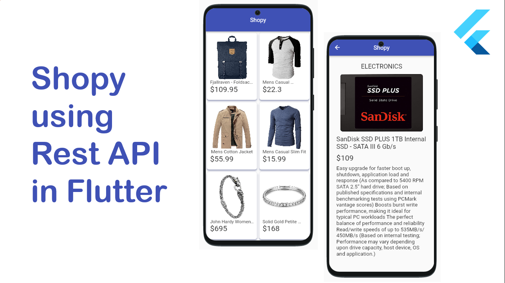

# 🛍️ Shopy – Shopping App (Flutter + REST API)

Shopy is a **Flutter-based shopping application template** that interacts with a REST API to provide a seamless and modern e-commerce experience. The app allows users to browse products and view details efficiently.

---

## 🚀 Features

- 🛒 Browse products from API  
- 🔍 View detailed product information  
- ⚡ Fast and responsive UI with Flutter  

---

## 🏗️ Tech Stack

### 📱 Frontend
- Flutter (Dart)
- Material UI

### 🌐 Backend
- REST API

### 🔗 API Integration
- HTTP
- JSON parsing

---

## ⚙️ Installation & Setup

### 1️⃣ Clone the repository
<code> git clone https://github.com/shk365/Shopy.git </code>  
<code> cd Shopy </code>

### 2️⃣ Install dependencies
<code> flutter pub get </code>

### 3️⃣ Run the app
<code> flutter run </code>

---

## Preview

---

## 📄 License

MIT License

---

## 👨‍💻 Author

**shk365**
